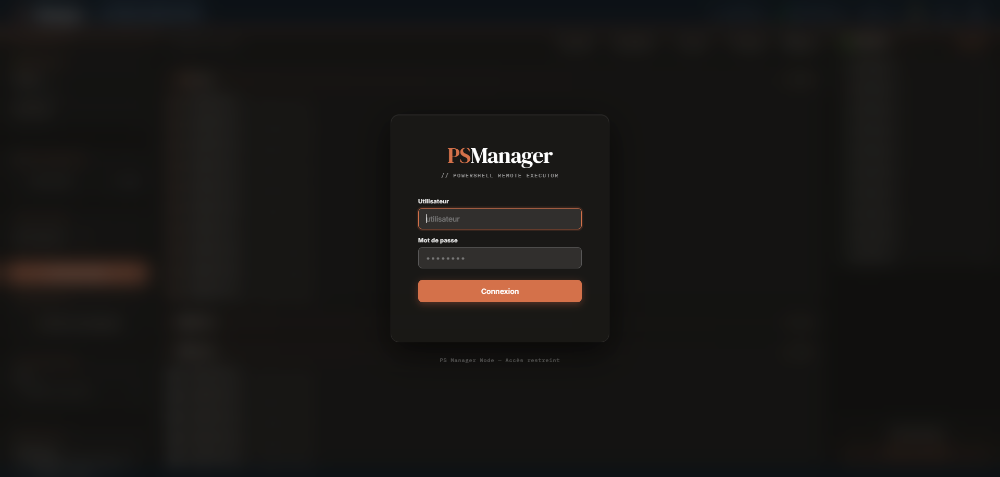

# PSManager

Interface web de gestion de parc informatique Windows via PowerShell WinRM.



## Présentation

PSManager est une application Node.js permettant d'administrer à distance un parc de postes Windows depuis un navigateur. Elle s'appuie sur WinRM (port 5985) et PowerShell pour exécuter des actions sur les machines distantes.

## Fonctionnalités

- **Exécution de scripts PowerShell** en masse avec parallélisme configurable
- **Extinction / Redémarrage** individuel ou par groupe
- **Wake-on-LAN** — envoi de magic packet UDP
- **Planification** — tâches différées (script, reboot, shutdown, WOL)
- **Copie de fichiers** vers les postes distants
- **Explorateur de fichiers** distant
- **Éditeur de registre** distant
- **Terminal PowerShell** interactif (xterm.js), sécurisé par vérification de session
- **Scan réseau** — découverte automatique des postes, avec annulation serveur
- **Scan LLDP intégré** au scan réseau — identification du port switch à la découverte
- **Inventaire WinRM** — collecte automatique (CPU, RAM, disque, logiciels, garantie...)
- **Sessions utilisateurs** — visualisation des sessions actives par groupe
- **LLDP** — identification du port switch d'un poste à la demande
- **Rapport CSV** exportable
- **Aspiration / déploiement de drivers**
- **Historique des logins**
- **Installation de logiciels** à distance (.exe / .msi)
- **Déploiement Veyon** — installation automatisée avec gestion de la clé privée prof et import des postes élèves depuis l'AD (LDAP)
- **Authentification LDAP/AD** avec vérification d'appartenance à un groupe
- **Interface responsive** — utilisable sur smartphone (navigation par onglets bas d'écran)
- **4 thèmes** : Jour, Nuit, Aurore, Couchant

## Prérequis

- Node.js 18+
- PowerShell 5.1+ sur le serveur
- WinRM activé sur les postes cibles (`winrm quickconfig`)
- Fichier d'inventaire `parc.txt` au format pipe `|`

## Installation

```bash
git clone https://github.com/supergonzales-byte/psmanager.git
cd psmanager
npm install
node server.js
```

L'interface est accessible sur `http://localhost:3000`.

## Configuration

| Chemin | Rôle |
|---|---|
| `C:\ps-manager\inventaire\parc.txt` | Fichier de parc (format pipe `|`) |
| `C:\ps-manager\scripts\` | Scripts PowerShell disponibles |
| `C:\ps-manager\veyon\` | Fichiers Veyon (installeur, config, clés) |
| `users.json` | Utilisateurs locaux (généré au premier lancement) |

## Déploiement Veyon

Le déploiement Veyon requiert 4 fichiers dans `C:\ps-manager\veyon\` :
- `veyon-x.x.x-win64-setup.exe` — installeur Veyon
- `veyon_configuration.json` — configuration exportée depuis Veyon Master
- `publickey` — clé publique
- `key` — clé privée (postes prof uniquement)

Les fichiers peuvent être déposés directement depuis la modale de déploiement (drag & drop ou sélection).

**Détection automatique du poste prof** : un poste dont le hostname se termine par `-P` suivi de 2 chiffres (ex : `SALLE01-PC-P01`) est traité comme poste professeur. Veyon y reçoit la clé privée et la liste des postes élèves récupérée automatiquement depuis l'AD via LDAP.

L'OU AD du poste prof doit contenir `Poste_Prof` ou `Postes_Prof` (variantes acceptées : avec `_`, `-`, espace ou sans séparateur, insensible à la casse) si le poste est seul dans son OU.

## Stack

- **Backend** : Node.js, Express, node-schedule, ws, node-pty, ldapts
- **Frontend** : HTML/CSS/JS vanilla, xterm.js
- **Remoting** : PowerShell WinRM (`Invoke-Command`, `Copy-Item -ToSession`)
- **Annulation** : toutes les opérations longues (scan, scripts, copie, drivers, Veyon) sont annulables côté serveur
